# Unit 21: Crowdsale Contract!

## <b> Background </b>

A new company has decided to crowdsale their PupperCoin token in order to help fund the network development.
This network will be used to track dog breeding activity across the globe in a decentralized way, and allow humans to track the genetic trail of their pets. They have already worked with the necessary legal bodies and obtained the green light on creating a crowdsale open to the public. However, they are required to enable refunds if the crowdsale is successful and the goal is met, and they are only allowed to raise a maximum of 300 ether. The crowdsale will run for 24 weeks.

In order to help them, I will create an ERC20 token that will be minted through a `Crowdsale` contract that I will leverage from the OpenZeppelin Solidity library.

This crowdsale contract will manage the entire process, allowing users to send ETH and get back PUP (PupperCoin).
This contract will mint the tokens automatically and distribute them to buyers in one transaction.

## <b> Summary </b>

I have accomplished the following main tasks through deployment of three smart contracts. These contracts were built and executed by using three tools namely Ganache, Remix, MetaMask and OpenZeppelin Solidity library.

* I created an `PupperCoin` contract which will build a mintable ERC20token and prepare it for a crowdsale
* Next, I created a `PupperCoinSale` and `PupperCoinSaleDeployer` contracts that will automatically manage end to end process of the crowdsale.
* Finally, I deployed the crowdsale on a local testnest where I tested the time functionality by setting the `close` time to be `now + 2 minutes`, to test for a shorter crowdsale.
* Finally I conducted the crowdsale on the Kovan testnet in order to get a real-world pre-production test in

## <b> Files locations in GitHub </b>

1. I have created a repository called `Crowdsale` in the Github.
2. Inside the above there is folder named `Code` which has all the above contracts which were tested on the timelock functionality:
* [`PupperCoin.sol`](Code/PupperCoin.sol)
* [`Crowdsale.sol`](Code/Crowdsale.sol)

## <b> Details on each tasks </b>

### <b> The `ERC20 PupperCoin` Contract </b>

Using Remix and a standard `ERC20Mintable` and `ERC20Detailed` contract, hardcoding `18` as the `decimals` parameter, and leaving the `initial_supply` parameter alone, I have created `PupperCoin.sol` file which create a standard `ERC20Mintable` token. <i> Note that I have not hardcoded the decimals; since most use-cases match Ethereum's default </i>.

This contract will build a mintable ERC20token and prepare it for a crowdsale.

### <b> The `PupperCoinCrowdsale` and `PupperCoinCrowdsaleDeployer` Contracts </b>

Created new contracts named `PupperCoinCrowdsale` and `PupperCoinCrowdsaleDeployer`, and prepared it like a standard crowdsale. The code is saved as `Crowdsale.sol`.

Here I have used the the following OpenZeppelin contracts:

* `Crowdsale`
* `MintedCrowdsale`
* `CappedCrowdsale`
* `TimedCrowdsale`
* `RefundablePostDeliveryCrowdsale`

I have provided parameters for all of the features of the crowdsale, such as the `name`, `symbol`, `wallet` for fundraising, `open` and `close` times, `goal`. Next I have hardcoded a `rate` of 1, to maintain parity with ether units (1 TKN per Ether, or 1 TKNbit per wei).

Since `RefundablePostDeliveryCrowdsale` inherits the `RefundableCrowdsale` contract, which requires a `goal` parameter, I called the `RefundableCrowdsale` constructor from `PupperCoinCrowdsale` constructor, as well as the others. `RefundablePostDeliveryCrowdsale` does not have its own constructor, so just used the `RefundableCrowdsale` constructor that it inherits.
<i> Note that if we forget to call the `RefundableCrowdsale` constructor, the `RefundablePostDeliveryCrowdsale` will fail since it relies on it (it inherits from `RefundableCrowdsale`), and does not have its own constructor. </i>

When passing the `open` and `close` times, used `now` and `now + 24 weeks` to set the times properly from the `PupperCoinCrowdsaleDeployer` contract.

### <b> Testing the Crowdsale </b>

After compiling the both the codes `PupperCoin.sol` and `Crowdsale.sol` in Remix, I did the deployment of the contracts to local Ganache chain by connecting to `Injected Web3` and ensured MetaMask was pointed to `localhost:8545`, with 0 wei in the following manner. 
<i> Note: I tested the time functionality by setting the `close` time to be `now + 2 minutes`, to test for a shorter crowdsale. </i>

Step 1: Deployed `PupperCoinCrowdsaleDeployer` first and entered the Name, Symbol, Wallet and Goal. There was a fee charged to the Ether account.
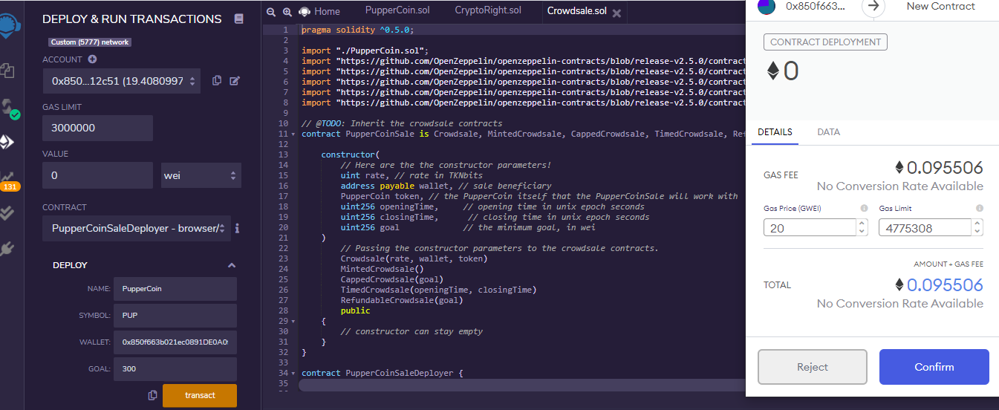

Step 2: Next deployed `PupperCoinSale` by copying the address from  the token_sale_address - call and copying it to the At Address

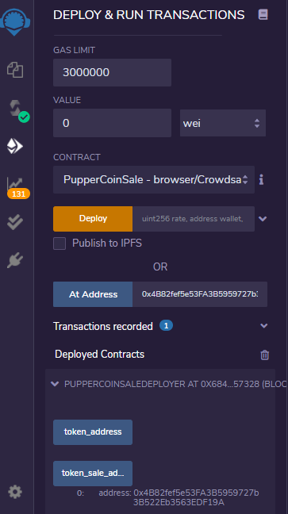

Step 3: Next deployed `PupperCoin` by copying the address from  the token_address - call and copying it to the At Address

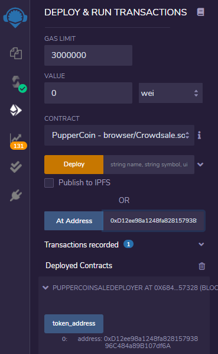

Step 4: Once all the contracts are deployed, I sent wei to the contract from a differnt account, and made sure the balance is equivalent to the `goal` of 300. I paid some gas.

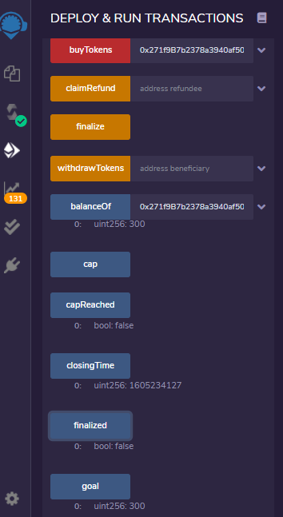

Step 5: Then I checked the features to see if the Goal is reached

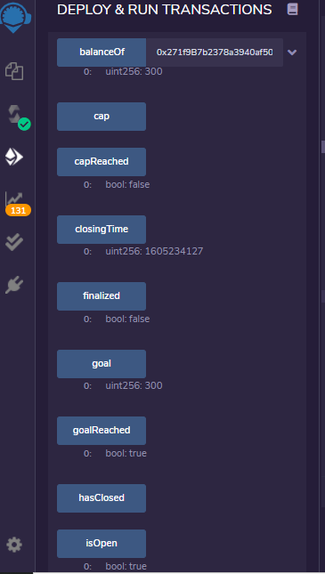

Step 6: After being satisfied, I finalized

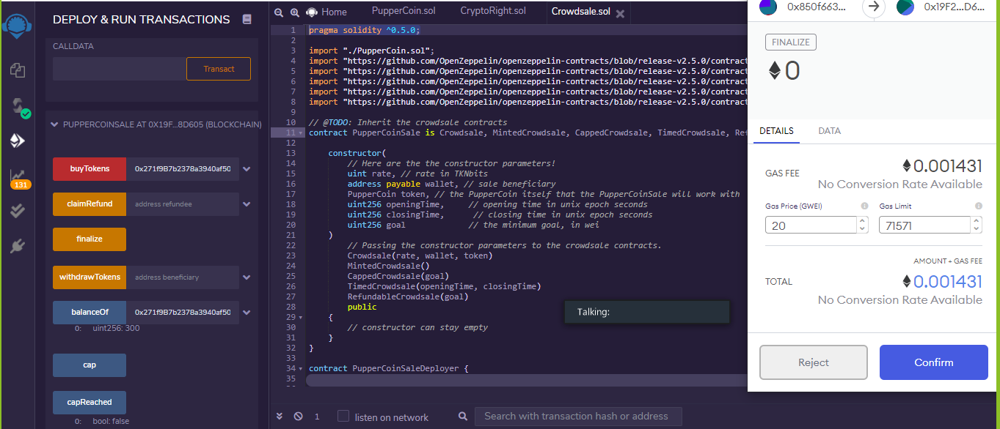

Step 7: Lastly, I checked if the feautures are updated. As expected `isOpen` is false (`isOpen` comes from `TimedCrowdsale` which checks to see if the `close` time has passed yet). 

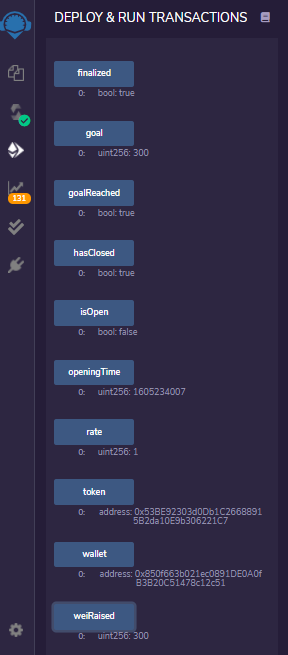

### <b> Deploying the Crowdsale </b>

I deployed the crowdsale to the Kovan testnet by switching the MetaMask to Kovan network and following the process step wise. I noticed that the total gas is much higher in case of real deployment.

Step 1: Transferred 1 ETH using (https://faucet.kovan.network/)

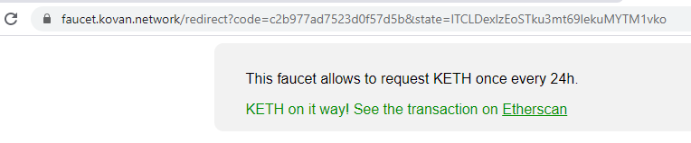

Step 2: Checked My Crypto Wallet for the ether balance

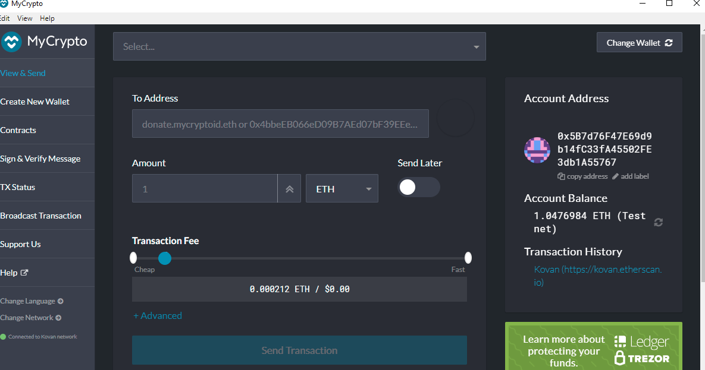

Step 3: Deployed the contracts, I sent wei to the contract from a differnt account, and made sure the balance is equivalent to the `goal` of 300. I paid some gas.

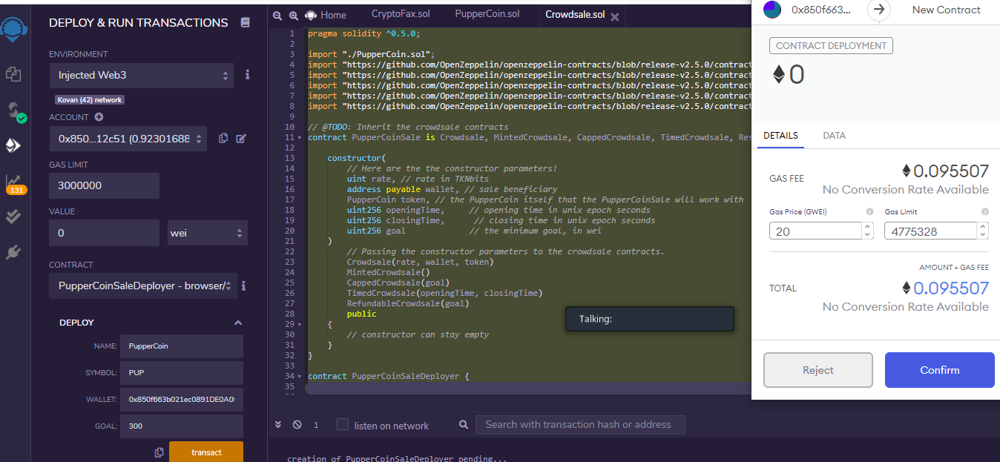

Step 4: Bought Tokens and paid some gas.

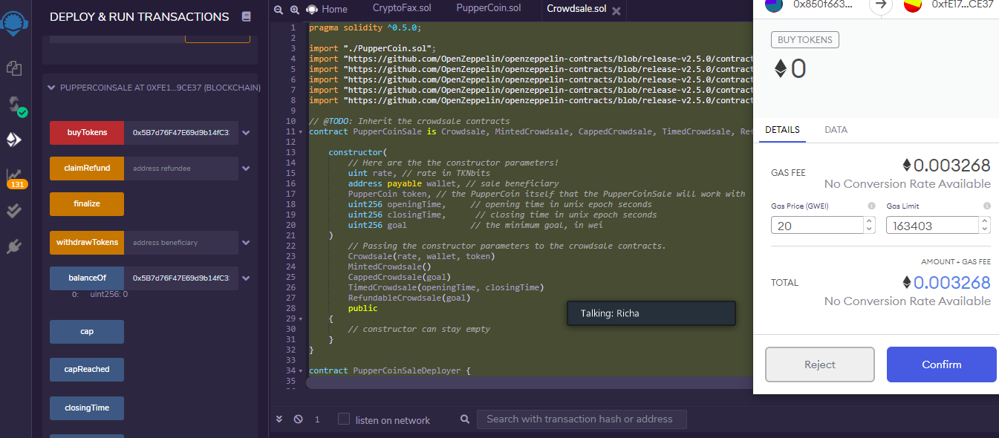

Step 5: Then I checked the features to see if the crowdsale is open and Goal is reached

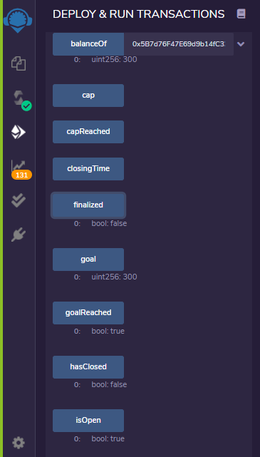

Step 6: After being satisfied, I tried to finalize but as expected got an error, as the crowdsale is open for 24 weeks from today 

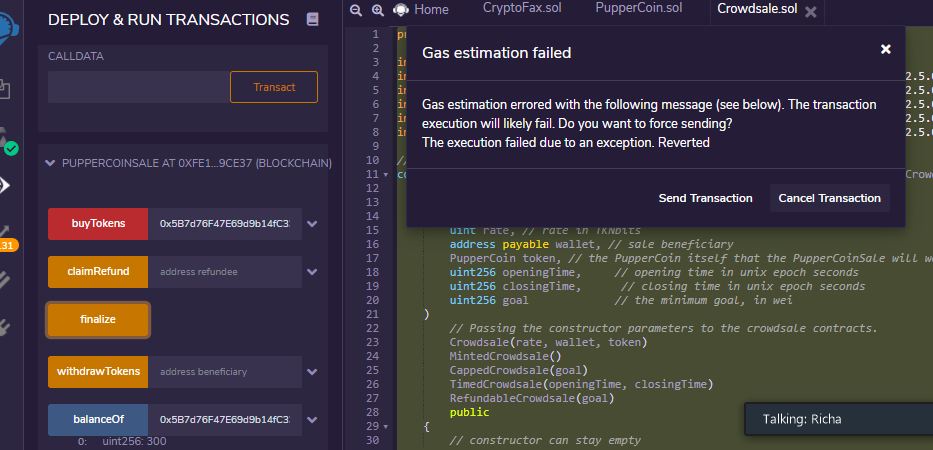

### Resources
[OpenZeppelin RefundableCrowdsale](https://docs.openzeppelin.com/contracts/2.x/crowdsales#crowdsale-rate)
